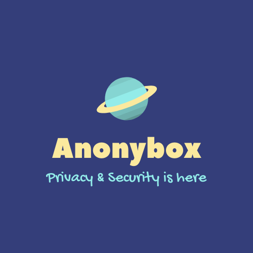

# Anonybox []() []() []()   


Official Launch for Anonybox Alpha 
> All rights reserved by Morad Abdelrasheed Mokhtar.
## Build & Run

For Server:
```bash
javac main.java
java main [encryption/decryption key]
```
For Client: 
```bash
javac client.java / client_demo.java
java client / client_demo [Host IP Address] [encryption/decryption key]
```
## Encryption details

It uses AES-256 Encryption with PKCS#5 Padding and IV customization (All Zeros in code).
Converts Key to SHA-1 Key to use it as a standard Key.

## License

Can be found on LICENSE.MD


<p align="center">
  
</p>
